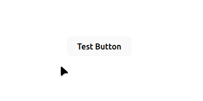
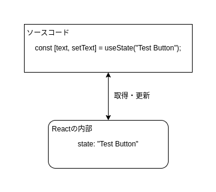
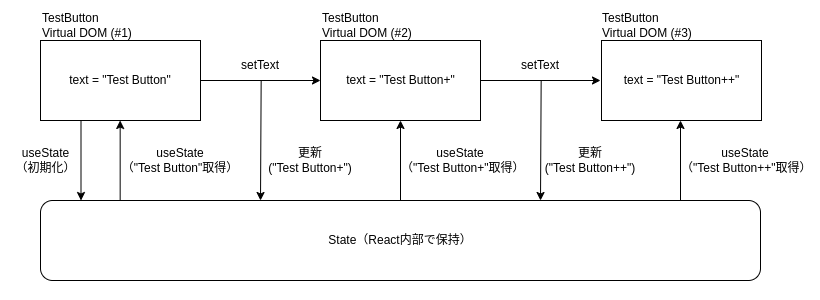

## はじめに

普段よく使っている React の state 管理がどのような仕組みで動いているか、ちゃんと深く考えたことがなかったので調査、分析してみました。

そして実際その原理などを深ぼってみると、、  
あれ、、これってこういうことだったの？  
全然わかってなかった、、、

そんなポイントが結構あったので、まとめてみたいと思います。

自分は React を初めて触ったのは 10 年近く前になりますし、業務では 5 年以上使っていると思いますが、  
業務経験が多くても知らない人は知らない、、（自分のただのスキル不足なら少し悲しいですが 😭😭）  
そんな内容をまとめたつもりなので、最後まで読んでもらえると幸いです！

## state はどこにある？

まず state を正確に理解したいと思います。  
そのための例として、次のようなコンポーネントを用意してみました。

```
export function TestButton() {
  const [text, setText] = useState("Test Button");
  const handleClick = () => {
    setText(text + "+");
  };
  return <button onClick={handleClick}>{text}</button>;
}
```

ボタンを押した回数だけ、`"+"`がテキストに追加されていく単純なボタンです。



さて、上記のコードにおいて、state はどこに存在するかを考えてみましょう。  
普通に考えれば state は定数 `text` のことを示しており、開発者同士でもこの定数を見ながら state の話を進めていくと思います。

- `text`: state
- `setText`: state を更新するための関数

このように考えて開発を進めがちですが、実はこの理解は少し不正確です。  
なぜなら `text` がもし本当に state そのものなら、この定数の型は何なのか？という話になります。  
`text` は `useState` を用いて初期値を `"Test Button"` として初期化しているので、型は `string` 型です。  
ただの文字列に過ぎないのです。

これはどういうことなのか？  
つまり `useState` で返している定数 `text` は state そのものではなく、「state のスナップショットの値」というのが正確です。  
だから定数 `text` はただの文字列であり `text` を直接更新しても state を更新することはできません（更新にはおなじみの `setText` コールバックを使います）。

最初の問いに戻りますが、上記のコードにおいて state はどこに存在するのか？  
答えはコード上には存在しません。  
`useState` によって state は初期化、作成はされますが、React の内部に保持、管理されています。  
コード上に存在しない state とのインターフェースとして `text` （読み取り専用の現在の値）と `setText` （更新用の関数）が与えられているというわけです。



## state 更新で何度もコンポーネントは作り直される

次に `setText` 関数を実行した時に何が起きるのかを詳しく見ていきたいと思います。  
先程のコンポーネントのコードを再掲します。

```
export function TestButton() {
  const [text, setText] = useState("Test Button");
  const handleClick = () => {
    setText(text + "+");
  };
  return <button onClick={handleClick}>{text}</button>;
}
```

レンダリングされている `button` 要素をクリックすると `onClick` コールバックが呼び出され、結果として `setText` 関数を呼び state 更新を実行します。  
この `setText` 関数を呼び出すことで実行されることは下記の２つです。

- state の値の更新
- コンポーネントの再レンダリング

この辺の話は馴染みのある人も多いと思いますが、よくよく考えるとかなり特殊です。  
state 更新の度に再レンダリングということは、この関数コンポーネントをその度に呼び出すことを意味します。  
再レンダリングなのだから、新しい DOM 要素を return しないといけない。  
だから関数コンポーネントをその度に呼び出す必要があるのですが、結果として先程の `text`、`setText`、`handleClick` などの定数も全て再生成し直しているということになります。

なんだかとても贅沢なリソースの使い方で、関数コンポーネント独自の設計思想です。  
ここまでを図にして表してみると次のようになります。



※一応誤解のないように述べておきますが、、  
何度も関数コンポーネントを呼び出すと言っても、それによって必ずしも DOM 更新されるとは限りません。  
React の差分アルゴリズムによって、レンダリング結果に変更がなければ DOM 更新はスキップされるためです。  
また memo 化することでキャッシュをもたせるなど、パフォーマンスチューニングも当然できます。

## おわりに
